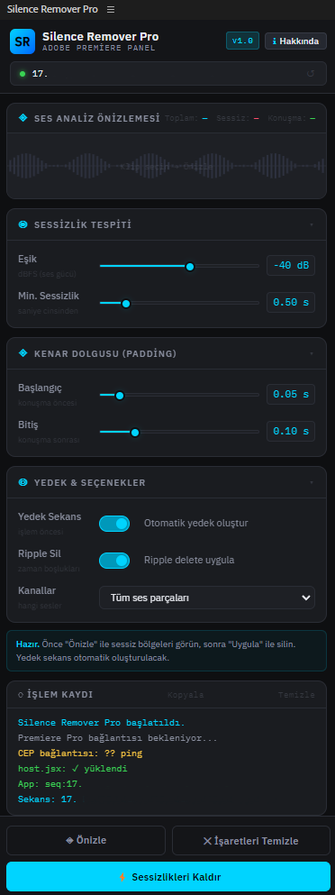
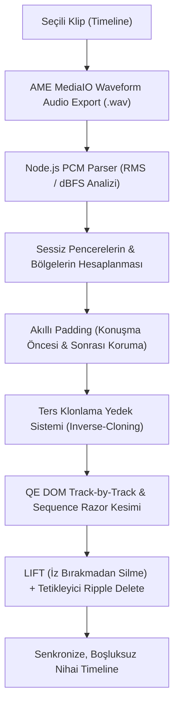

# Silence Remover Pro (Adobe Premiere Pro Extension)

[](https://www.adobe.com/products/premiere.html)
[](https://github.com/ferhatsavtak)
[](https://www.linkedin.com/in/ferhatsavtak/)

**Silence Remover Pro**, Adobe Premiere Pro timeline'ındaki ses ve video kayıtlarında yer alan sessizlikleri **gerçek ses dalga formu (dBFS genliği)** üzerinden otomatik olarak tespit eden, tüm kanalları (video, ses ve altyazı/metin katmanları) senkronize biçimde kesip **Ripple Delete** ile aradaki boşlukları sıfırlayan gelişmiş bir Adobe CEP eklentisidir.

<p align="center">
  
</p>

---

## 🌟 Öne Çıkan Özellikler

- 🎙️ **Gerçek Dalga Formu (PCM dBFS) Analizi:** Sadece timeline'daki boşlukları değil; seçilen klibin gerçek ses dalgasını 20ms'lik pencerelerle okuyarak RMS ve dBFS genlik değerlerini inceler.
- 📊 **Akıllı Gürültü Tabanı & Eşik Önerisi:** Ses klibinin *Peak (En Yüksek)*, *Average (Ortalama)* ve *Noise Floor (Gürültü Tabanı)* değerlerini hesaplar ve en ideal kesim eşiğini (Threshold) otomatik olarak önerir.
- ✂️ **Çok Kanallı Senkronize Kesim & Ripple Delete:**
  - Tüm video kanalları (V1, V2, V3...) ve ses kanalları (A1, A2, A3...) aynı anda dilimlenir.
  - V3 veya diğer kanallarda yer alan **Essential Graphics / Altyazı (MOGRT/Text)** katmanları dahil tüm katmanlar senkron şekilde kesilir.
  - Kesilen sessizlik bölgeleri boşluk bırakmadan sola kaydırılarak (**Ripple Delete**) timeline tek parça haline getirilir.
- 🛡️ **Akıllı Konuşma Kenar Dolgusu (Padding):**
  - **Başlangıç (Konuşma Öncesi):** Konuşmanın ilk hecelerinin veya nefes başlangıçlarının kesilmesini önlemek için sol tarafa güvenlik payı ekler.
  - **Bitiş (Konuşma Sonrası):** Cümle sonlarındaki kelime bitişlerinin bıçak gibi kesilmesini engelleyerek doğal konuşma akışı sağlar.
- 💾 **Ters-Klonlama (Inverse-Cloning) ile Güvenli Yedekleme:**
  - Kesim yapılmadan önce orijinal sekans otomatik olarak klonlanır.
  - Dokunulmamış yedek sekans proje penceresinde `Yedek Sekanslar` klasörüne taşınır.
  - Çalışılan sekansın adı ve bütünlüğü korunur; geri alma veya eski haline dönme son derece kolaydır.
- 📋 **İşlem Kaydı & Panoya Kopyalama:** Yapılan tüm işlemler, tespit edilen dB değerleri ve silinen bölgeler panelde canlı olarak loglanır; tek tıkla panoya kopyalanabilir.

---

## 🖥️ Desteklenen Sürümler & Sistem Gereksinimleri

- **Uygulama:** Adobe Premiere Pro CC 2021 ve üzeri (Premiere Pro 2024, 2025, 2026 ile tam uyumlu)
- **İşletim Sistemi:** Windows 10 / 11 veya macOS (Intel & Apple Silicon)
- **Teknoloji:** Adobe CEP 9.0+, Node.js Runtime, ExtendScript ES3, QE DOM

---

## 📦 Kurulum (Adım Adım)

### 1. CEP Debug Modunu Aktif Edin
Adobe Premiere Pro'nun imzasız geliştirici panellerini çalıştırmasına izin vermek için debug modunu açın:

#### Windows:
1. `Win + R` tuşlarına basıp `regedit` yazarak Kayıt Defteri Düzenleyicisi'ni açın.
2. Aşağıdaki konuma gidin:
   ```text
   HKEY_CURRENT_USER\Software\Adobe\CSXS.11
   ```
   *(Eğer CSXS.10, CSXS.12 veya CSXS.14 varsa onlar için de geçerlidir)*
3. Boş bir alana sağ tıklayın: **Yeni > Dize Değeri (String Value)** seçin.
4. İsim olarak `PlayerDebugMode`, değer olarak `1` yazın.

#### macOS:
Terminal'i açıp şu komutu çalıştırın:
```bash
defaults write com.adobe.CSXS.11 PlayerDebugMode 1
```

---

### 2. Eklenti Dosyalarını İlgili Klasöre Kopyalayın
Bu projeyi indirin veya klonlayın, ardından klasör adını `SilenceRemover` yaparak aşağıdaki dizine taşıyın:

- **Windows:**
  ```text
  C:\Users\<KULLANICI_ADINIZ>\AppData\Roaming\Adobe\CEP\extensions\SilenceRemover
  ```
  *(Çalıştır penceresine `%APPDATA%\Adobe\CEP\extensions\` yazarak hızlıca gidebilirsiniz)*

- **macOS:**
  ```text
  /Library/Application Support/Adobe/CEP/extensions/SilenceRemover
  ```
  veya
  ```text
  ~/Library/Application Support/Adobe/CEP/extensions/SilenceRemover
  ```

---

### 3. Premiere Pro'yu Başlatın
1. Adobe Premiere Pro'yu açın.
2. Üst menüden **Window > Extensions > Silence Remover Pro** (Pencere > Uzantılar) yolunu izleyerek paneli açın.

---

## 🚀 Kullanım Rehberi

1. **Klip Seçin:** Timeline üzerinde sessizliklerini temizlemek istediğiniz ana ses klibine bir kez tıklayarak seçili hale getirin.
2. **Önizleme Alın:** Paneldeki **◈ Önizle** butonuna tıklayın.
   - Eklenti klibi hızlıca analiz eder, ses seviyelerini ölçer.
   - Paneldeki işlem kaydında (Log) klibinizin *Peak*, *Average* ve *Noise Floor* değerleri görünür.
3. **Eşik Ayarını Yapın:** Log penceresinde tavsiye edilen dB değerini **Eşik (Threshold)** kaydırıcısına girin.
4. **Kenar Dolgusu (Padding):** Konuşmaların doğal akması için başlangıç ve bitiş koruma sürelerini (örn. `0.08 s` - `0.15 s`) belirleyin.
5. **Uygula:** **⚡ Sessizlikleri Kaldır** butonuna tıklayın.
   - Orijinal sekansın bir yedeği `Yedek Sekanslar` binine kopyalanır.
   - Tüm video, ses ve V3 altyazı katmanları senkronize olarak kesilip aradaki sessizlikler Ripple Delete ile birleştirilir.

---

## 🛠️ Teknik Mimari



---

## 👨‍💻 Geliştirici & İletişim

Bu proje, video kurgu süreçlerini hızlandırmak ve stüdyo iş akışlarındaki tekrarlayan montaj yükünü ortadan kaldırmak amacıyla **Ferhat Savtak** tarafından geliştirilmiştir.

- 💼 **LinkedIn:** [linkedin.com/in/ferhatsavtak](https://www.linkedin.com/in/ferhatsavtak/)
- 🐙 **GitHub:** [github.com/ferhatsavtak](https://github.com/ferhatsavtak)

